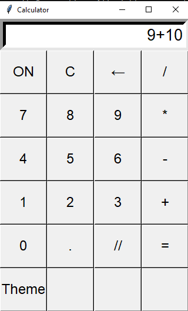
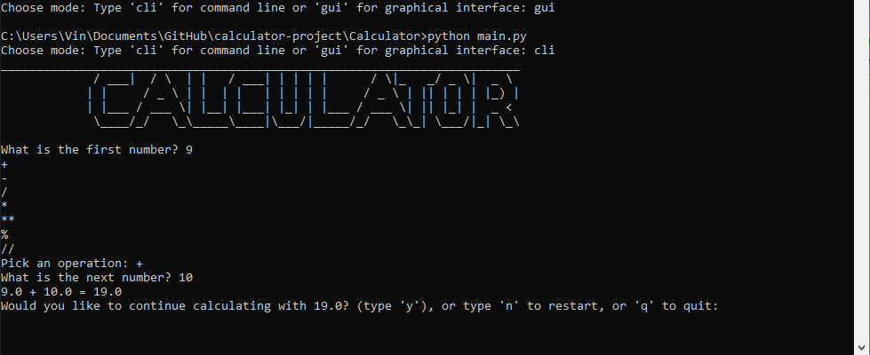

# Calculator App

This is a simple calculator project that gives the user the option to choose between a command-line or graphic interface (Tkinter library). 

# Features
- Allows for basic operations (addition, subtraction, division, exponents, floor division, etc) 
- Option to choose between a command-line or graphical interface
- Quality of life improvements such as backspace, decimal point, restart, and night mode

# Installation steps
**Clone the repository:**
```
git clone https://github.com/VinPal5554/calculator-project
cd calculator-project
```
**Run the app:**
```
python main.py
```





